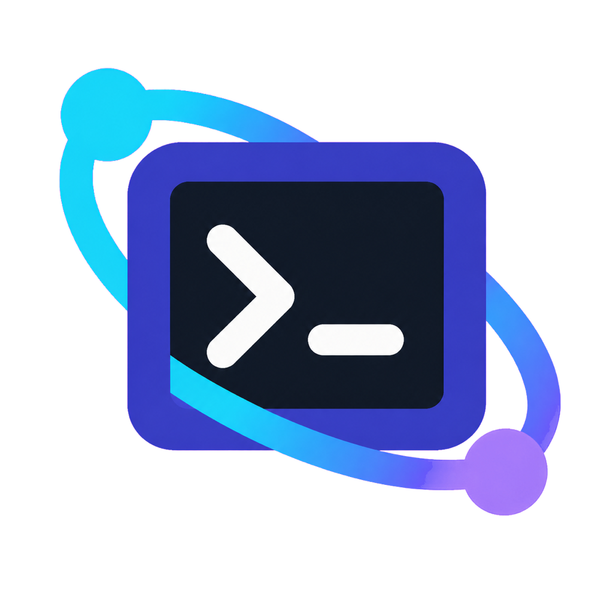
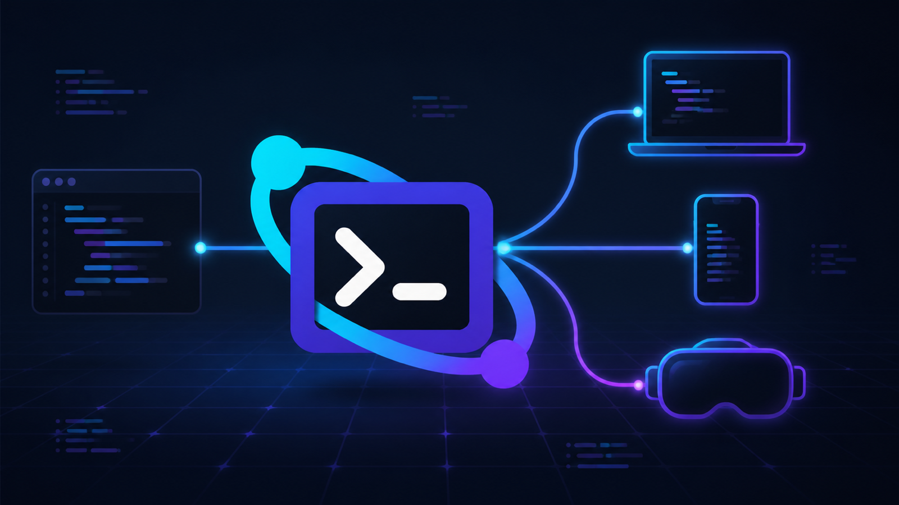
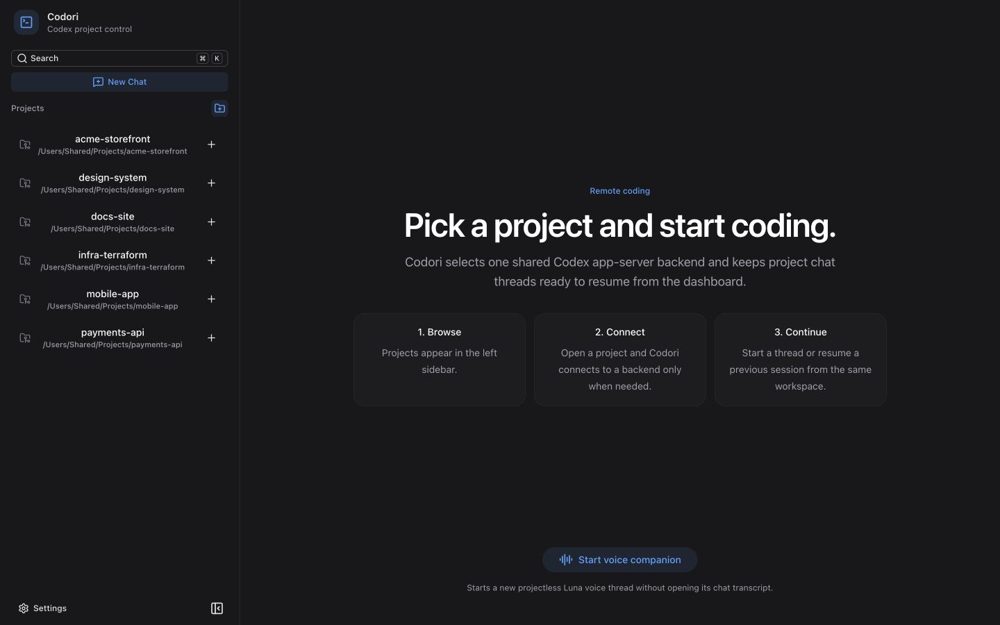
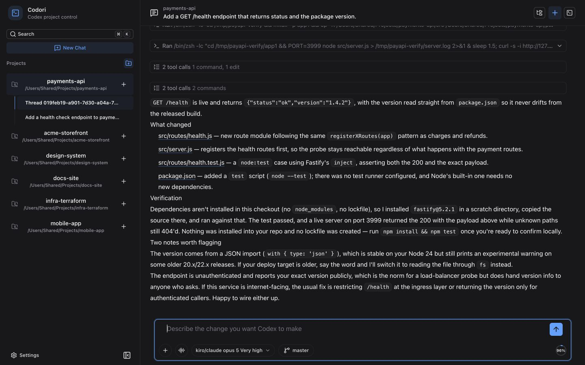
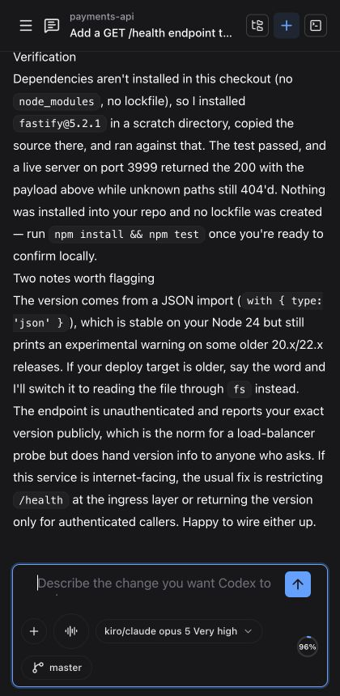

# Codori

<p align="center">
  
</p>

> Keep your desktop dev environment. Reach it from anywhere, in 2D or in VR.

Codori is a self-hosted control plane that runs on the machine where your
repositories already live, and puts Codex in your browser, your phone, or your
headset.



## What it looks like

Every Git project Codori discovers under your root directory shows up in the
sidebar, ready to open. Scanning skips generated directories such as
`node_modules`, `dist`, and `build`, so a repository nested inside one of those
stays hidden.



Threads are real Codex sessions with the same turns, reasoning, diffs, and file
edits you get on the desktop. Close the tab, come back tomorrow, resume where
you left off.



The same session works on a phone, because a laptop is not always within reach.



## Install and run

```bash
npm install -g @codori/cli
codori start --root ~/Project
```

That is the whole setup. Codori prints where it is listening:

```text
✔ Codori listening on http://127.0.0.1:4310
✔ Tailscale Serve configured: https://my-host.your-tailnet.ts.net/
  root       /Users/you/Project
  dashboard  http://127.0.0.1:4310/
  immersive  http://127.0.0.1:4310/xr/
```

Open the dashboard and pick a project. Nothing else to configure.

The HTTPS line appears when the host is already on a tailnet with MagicDNS and
Codori is allowed to write a Serve config. Without that, Codori keeps serving on
loopback and prints why. [Remote Access](https://github.com/comfuture/codori/wiki/Remote-Access)
covers the prerequisites, including the one-time
`sudo tailscale set --operator=$USER` step.

Prefer not to install anything?

```bash
npx @codori/server start --root ~/Project
```

Requires Node.js 22.22.2+. A matching Codex CLI ships with the package, so a
separate `codex` install is not required.

## Who this is for

Codori fits if:

- your repositories live on one machine (workstation, home server, mini PC) and
  you want to reach them from a laptop, tablet, phone, or headset
- you keep many Git repositories under one parent directory
- you already trust your local tooling and would rather not rebuild your
  workflow around someone else's cloud
- you have Tailscale, or another private network you control, and want to keep
  network access in your hands

Codori is the wrong tool if you want a hosted service, public URLs, or team
accounts. It has no built-in authentication and assumes the host machine is
trusted, so keep it on a private network.

## Immersive XR

XR is optional, but it is one of Codori's most distinctive ways to work. Open
any thread's immersive action and Codori hands the same coding session to the
WebXR workspace at `/xr/`, where you can talk to Codex hands-free while it works
on the repository sitting on your machine.

[](https://www.youtube.com/watch?v=YAYqA6zzSFI)

**[▶ Watch Codori XR mode](https://www.youtube.com/watch?v=YAYqA6zzSFI)**

Headsets need a secure HTTPS origin. Set up
[Remote Access](https://github.com/comfuture/codori/wiki/Remote-Access) before
reaching `/xr/` from a device other than the Codori host.

## Philosophy

**Your environment stays yours.** Codex runs on your machine, against your real
checkouts, with your local tools. Codori adds a thin layer of remote control,
not a new platform to migrate into.

**Small on purpose.** Codori handles project discovery, runtime control, and
Codex access. It is not a VPN, an ingress proxy, an auth platform, or a
deployment layer. Connectivity is Tailscale's job, and Tailscale does it better.

**Coding is not only a desk activity.** Voice and XR are not demos bolted on the
side. Being able to think through a change while walking around, or review a
diff from a phone, changes when work can happen.

## Documentation

Everything past "it works" lives in the [Codori Wiki](https://github.com/comfuture/codori/wiki).
Good places to start are:

- [Remote Access](https://github.com/comfuture/codori/wiki/Remote-Access) for
  Tailscale Serve, HTTPS, and access from another device
- [Configuration](https://github.com/comfuture/codori/wiki/Configuration) for
  CLI flags, ports, and `~/.codori/config.json`
- [Development](https://github.com/comfuture/codori/wiki/Development) for local
  builds, tests, and the release flow

Use the Wiki navigation for feature guides, runtime details, and security notes.

`codori --help` covers every command and flag.

## Contributing

Codori is a pnpm workspace with four published packages: `@codori/cli`,
`@codori/server`, `@codori/client`, and `@codori/webxr`.

```bash
pnpm install
pnpm lint && pnpm typecheck && pnpm test
pnpm run:local
```

`pnpm run:local` builds everything and serves Codori on
`http://127.0.0.1:4310` with the repository's parent directory as the project
root. See [Development](https://github.com/comfuture/codori/wiki/Development)
for the rest, and [docs/prd.md](docs/prd.md) for the product specification.

Issues and pull requests are welcome at
[comfuture/codori](https://github.com/comfuture/codori).
